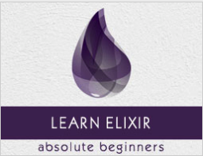

```
Roberto Nogueira  
BSd EE, MSd CE
Solution Integrator Experienced - Certified by Ericsson
```
# Tutorialspoint Elixir



**About This Tutorial**

This is to grasp rapidly the language and its concepts.

[Elixir Tutorial](https://www.tutorialspoint.com/elixir/index.htm)

#### Topics
```
Elixir Tutorial
[x] Home
[ ] Overview
[ ] Environment
[ ] Basic Syntax
[ ] Data Types
[ ] Variables
[ ] Operators
[ ] Pattern Matching
[ ] Decision Making
[ ] Strings
[ ] Char Lists
[ ] Lists and Tuples
[ ] Keyword Lists
[ ] Maps
[ ] Modules
[ ] Aliases
[ ] Functions
[ ] Recursion
[ ] Loops
[ ] Enumerables
[ ] Streams
[ ] Structs
[ ] Protocols
[ ] File I/O
[ ] Processes
[ ] Sigils
[ ] Comprehensions
[ ] Typespecs
[ ] Behaviours
[ ] Errors Handling
[ ] Macros
[ ] Libraries
[ ] Project
Elixir Useful Resources
[ ] Quick Guide
[ ] Useful Resources
[ ] Discussion
Selected Reading
[ ] Developer's Best Practices
[ ] Questions and Answers
[ ] Effective Resume Writing
[ ] HR Interview Questions
[ ] Computer Glossary
[ ] Who is Who
```

